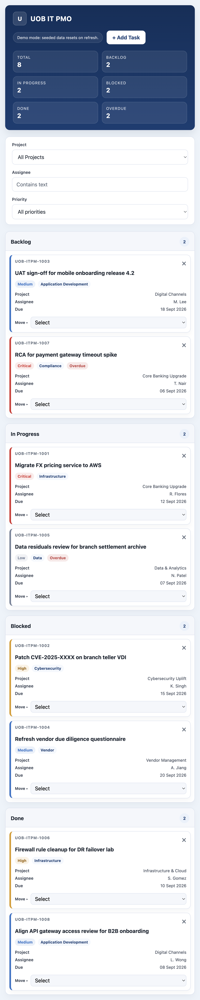

# UOB IT PMO Board

A browser-only IT project management demo for an internal PMO board. It uses vanilla HTML, CSS, and JavaScript with seeded in-memory data and no build step.

## Features

- Kanban board with Backlog, In Progress, Blocked, and Done columns
- Live project, assignee, and priority filters
- Drag-and-drop task movement with a keyboard-accessible move selector
- Inline task creation, validation, deletion confirmation, and toast feedback
- Optional FormSubmit email notification for new tasks

## Run locally

Open [index.html](index.html) directly in a browser. The demo resets to its seeded data whenever the page is refreshed.

## GitHub Pages

The published site is available at <https://tbone2024.github.io/ClaudeCodePilot/>.

## Project structure

- [index.html](index.html): complete static application
- [screenshots/board.png](screenshots/board.png): Playwright capture of the default board
- [.github/workflows/pages.yml](.github/workflows/pages.yml): GitHub Pages deployment workflow
